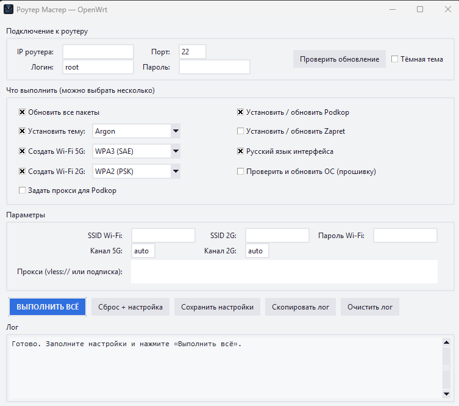
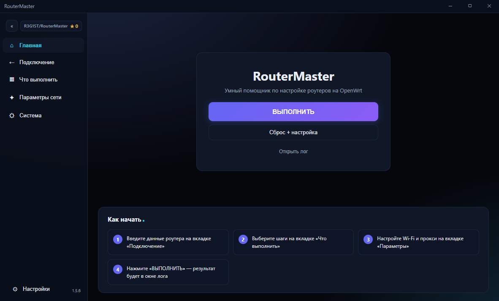

<div align="center">

# 📡 RouterMaster

**Умный помощник по настройке роутеров на OpenWrt**

[]()
[]()
[]()
[]()
[](https://github.com/R3G1ST/RouterMaster/stargazers)

**Одна кнопка — полностью настроенный роутер: обход блокировок, темы LuCI, Wi-Fi, прокси и русский язык.**
<p align="center">
  <a href="https://routermaster.ru">
    
  </a>
</p>

</div>

---

## ✨ Возможности

| Возможность | Описание |
|---|---|
| 🧹 **Сброс + настройка** | Полный сброс до заводских настроек → автоматическая установка пароля через LuCI → полная настройка с нуля одной кнопкой |
| 🚀 **Podkop** | Установка/обновление Podkop со всеми 22 community-списками (russia_inside, youtube, tiktok, discord и др.) + кнопка удаления |
| 🔓 **Zapret** | Установка Zapret-Manager (StressOzz) + Zapret под ключ: стратегия v7, 50-stun4all, hosts + кнопка удаления |
| 🎨 **Темы LuCI** | Argon, Proton2025, Bootstrap (тёмная/светлая) — автоматическая установка из GitHub |
| 📶 **Wi-Fi 5G и 2G** | SSID, канал и тип шифрования для каждой сети отдельно (WPA3, WPA2, переходный, открытая) |
| 🔑 **Прокси** | Вставьте `vless://...` или ссылку на подписку — Podkop настроится сам |
| 🌐 **Русский язык** | Установка локализации LuCI |
| 🔄 **Обновление ОС** | Проверка и обновление прошивки OpenWrt |
| 🔔 **Автообновление** | Проверка новых версий из GitHub + тихая установка отдельным updater-процессом, программа перезапускается сама |
| 🧪 **Бета-обновления** | Галочка «Получать бета-версии» — доступ к prerelease. Кнопка «Откатить на стабильную» |
| 🎭 **Темы интерфейса** | Светлая и тёмная темы программы — переключаются галочкой, заголовки окон в цвет темы |
| 🌍 **Локализация** | Полная локализация интерфейса и логов на русский и английский языки |
| ⚙️ **Настройки** | Размер шрифта, папка загрузок, язык, автопроверка обновлений, бета-релизы — всё в одном месте |

## 🙏 Поддержать проект

Если RouterMaster помогает вам, вы можете поддержать развитие проекта:

[](https://finance.ozon.ru/apps/sbp/ozonbankpay/019e1286-96ed-761a-94a4-f3c252d75937)

### 💰 Криптовалюта

| Криптовалюта | Адрес кошелька |
| :--- | :--- |
| **TON** | `UQAEv0Tw5_O4BJCRf3wXiiXj_uL68kraLYRCAqJ6BFomHr6n` |
| **USDT (сеть TON)** | `UQAEv0Tw5_O4BJCRf3wXiiXj_uL68kraLYRCAqJ6BFomHr6n` |
| **BTC** | `bc1ql779pzpunajhfdhgme9qwtgsv3z8jphe4652wm` |

Спасибо за вашу поддержку! ❤️

## 🖥️ Скриншоты

| Светлая тема | Тёмная тема |
|---|---|
|  |  |

> Тема переключается галочкой **«Тёмная тема»** в окне программы и запоминается в настройках.

---

## 📥 Установка

### Вариант 1 — установщик (рекомендуется)

1. Скачайте **`RouterMaster-Setup.exe`** из последнего [релиза](https://github.com/R3G1ST/RouterMaster/releases/latest)
2. Запустите установщик
3. Нажмите «Далее» → «Установить»
4. Запустите RouterMaster с рабочего стола или из меню «Пуск»

### Вариант 2 — из исходников

```bash
git clone https://github.com/R3G1ST/RouterMaster.git
cd RouterMaster
pip install -r requirements.txt
python router_master.py
```

> ⚠️ **Требования:** Windows 10/11, Python 3.10+ (для запуска из исходников).

---

## 🚀 Быстрый старт

1. **Подключите роутер** к компьютеру (кабель в LAN-порт) — по умолчанию `192.168.1.1`
2. **Введите данные роутера**: IP, логин `root` и пароль SSH
3. **Отметьте нужные шаги** (можно несколько):
   - ✅ Обновить все пакеты
   - ✅ Установить / обновить Podkop
   - ✅ Установить / обновить Zapret
   - ✅ Установить тему
   - ✅ Русский язык интерфейса
   - ✅ Создать Wi-Fi 5G / 2G (с выбором шифрования)
   - ✅ Задать прокси для Podkop
4. **Заполните параметры**: SSID, пароль Wi-Fi, каналы, прокси-ссылку
5. Нажмите **«ВЫПОЛНИТЬ»** 🚀

Программа сама:
- подключается по SSH,
- выполняет все шаги по очереди,
- показывает прогресс в логе с таймером времени,
- перезагружает роутер и ждёт его возвращения,
- сообщит, когда всё готово (обновите страницу LuCI через `Ctrl+F5`).

### Кнопка «Сброс + настройка»

Полный сброс роутера → перезагрузка → автоматическая установка пароля → автоматическая полная настройка (Wi-Fi, Podkop, тема, язык). Обычно весь процесс занимает **3–4 минуты**, редко — дольше. Роутер вернётся полностью чистым и настроенным.

### Кнопки удаления

Podkop и Zapret можно полностью удалить с роутера отдельными кнопками.

---

## 🔄 Обновление программы

В правом верхнем углу нажмите **«Проверить обновление»**:

- программа свяжется с GitHub и сравнит версии;
- если вышла новая версия — спросит разрешение;
- скачает установщик, запустит отдельный updater-процесс и закроется;
- updater тихо установит обновление без окон и сам запустит новую версию.

### Бета-обновления

В настройках есть галочка **«Получать бета-версии»** — при включении программа будет предлагать prerelease-сборки. Если бета уже установлена, появится кнопка **«Откатить на стабильную»**.

Обновление занимает меньше минуты, все настройки программы сохраняются.

---

## ⚙️ Настройки

> ℹ️ **Где хранятся настройки:**
>
> Все настройки (и папка загрузок тем) хранятся **не рядом с программой**, а в папке пользователя:
>
> ```
> %APPDATA%\RouterMaster\
> ├── router_tool_config.json   # все настройки программы
> └── downloads\                # скачанные темы (apk-файлы)
> ```
>
> На практике это `C:\Users\<имя_пользователя>\AppData\Roaming\RouterMaster\`.
> Открыть быстро: нажмите `Win+R`, вставьте `%APPDATA%\RouterMaster` и Enter.
>
> Благодаря этому программа работает с любого диска (включая `C:\Program Files`) без прав администратора, а при установке обновлений настройки не теряются.

Что хранится в `router_tool_config.json`:

- IP/порт/логин/пароль роутера
- SSID, пароль и каналы Wi-Fi (5G и 2G)
- Тип шифрования для каждой сети
- Тема LuCI
- Прокси-строка
- Тема интерфейса (светлая/тёмная)
- Размер шрифта
- Язык интерфейса (русский/английский)
- Папка загрузок тем
- Автопроверка обновлений (вкл/выкл)
- Получать бета-версии (вкл/выкл)
- Выбранные шаги

Настройки сохраняются кнопкой **«Сохранить настройки»** и автоматически при закрытии программы. При первом запуске старый файл настроек (если он лежал рядом с программой) переносится в `%APPDATA%` автоматически.

---

## 🔧 Сборка из исходников

### Программа (PyInstaller)

```bash
pip install -r requirements.txt pyinstaller
pyinstaller --onefile --windowed --icon assets/icon.ico ^
            --add-data "assets;assets" ^
            --collect-all webview ^
            --hidden-import webview.platforms.winforms ^
            --hidden-import webview.platforms.edgechromium router_master.py
```

### Updater (C# .NET Framework)

```bash
C:\Windows\Microsoft.NET\Framework64\v4.0.30319\csc.exe /target:winexe /optimize+ ^
    /out:assets\rm_updater.exe installer\Updater.cs
```

### Установщик (Inno Setup 6)

1. Скомпилируйте exe (см. выше)
2. Откройте `installer/setup.iss` в Inno Setup
3. Build → Compile

---

## 📁 Структура проекта

```
RouterMaster/
├── router_master.py          # Основная программа (логика + pywebview)
├── assets/
│   ├── icon.ico              # Иконка программы
│   ├── rm_updater.exe        # Updater для тихой установки обновлений
│   └── ui/                   # Веб-интерфейс (index.html, style.css, app.js)
├── installer/
│   ├── setup.iss             # Скрипт инсталлятора (Inno Setup)
│   └── Updater.cs            # Исходник updater (C#)
├── screenshots/
│   ├── light.png             # Скриншот светлой темы
│   └── dark.png              # Скриншот тёмной темы
└── requirements.txt          # Зависимости Python (paramiko, pywebview)
```

---

## 🤝 Благодарности

- [Podkop](https://github.com/itdoginfo/podkop) — обход блокировок на OpenWrt
- [Zapret-Manager](https://github.com/StressOzz/Zapret-Manager) — менеджер Zapret
- [luci-theme-argon](https://github.com/jerrykuku/luci-theme-argon) — тема Argon
- [luci-theme-proton2025](https://github.com/ChesterGoodiny/luci-theme-proton2025) — тема Proton2025


## 📄 Лицензия

Проект распространяется под лицензией **MIT**. Используйте свободно, на свой страх и риск — автор не несёт ответственности за настройки вашего роутера.
